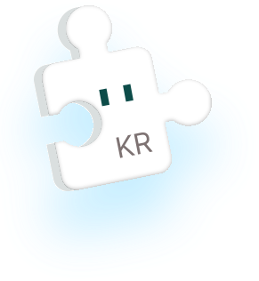
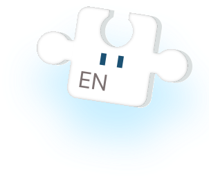
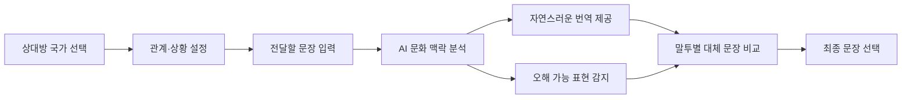

<div align="center">

  

  # MalGo

  ### 그냥 번역하지 말고, 문화까지.

  상대방의 국가·문화·관계·상황을 고려해  
  더 자연스럽고 안전한 표현을 제안하는 AI 문화 번역 서비스

  <br />

  
  
  
  

  <br />
  <br />

  
  

</div>

---

## MalGo 소개

**MalGo**는 단순히 문장을 다른 언어로 바꾸는 번역 서비스를 넘어,  
상대방의 **국가, 문화, 관계, 대화 상황과 원하는 말투**까지 고려해 문장을 제안하는 AI 글로벌 커뮤니케이션 서비스입니다.

문법적으로 올바른 문장이라도 문화적 배경에 따라 무례하거나 공격적으로 받아들여질 수 있습니다. MalGo는 이러한 문화적 차이를 분석하여 사용자가 자신의 의도를 더 정확하게 전달할 수 있도록 돕습니다.

> 같은 뜻이라도 문화에 따라 전달되는 느낌은 달라질 수 있습니다.  
> MalGo는 문장뿐 아니라 문장이 받아들여지는 방식까지 번역합니다.

---

## 해결하려는 문제

기존 번역 서비스는 주로 단어와 문장의 의미를 다른 언어로 변환하는 데 집중합니다. 하지만 실제 글로벌 커뮤니케이션에서는 문법적 정확성만큼이나 **상대방이 해당 표현을 어떻게 받아들이는지**가 중요합니다.

특히 다음과 같은 표현은 문화에 따라 다른 의미로 전달될 수 있습니다.

- 존댓말과 반말
- 부탁과 거절 표현
- 칭찬과 외모에 관한 표현
- 농담과 유머
- 나이와 결혼 여부에 관한 질문
- 종교, 정치, 성별과 관련된 표현
- 직장 상사, 친구, 연인 등 관계별 말투

MalGo는 직역으로 인해 발생할 수 있는 오해를 줄이고, 상황에 어울리는 표현을 선택할 수 있도록 지원합니다.

---

## 핵심 기능

| 기능 | 설명 |
| --- | --- |
| 문화 맥락 설정 | 상대방의 국가, 관계, 대화 상황을 선택합니다. |
| AI 문화 번역 | 문장의 뜻과 의도를 유지하면서 자연스럽게 번역합니다. |
| 오해 가능성 알림 | 무례하거나 공격적으로 받아들여질 수 있는 표현을 알려줍니다. |
| 문화 차이 설명 | 원문이 상대 문화에서 어떻게 받아들여질 수 있는지 설명합니다. |
| 말투 선택 | 정중한 말투, 친근한 말투, 업무용 말투 등 여러 버전을 제공합니다. |
| 대체 문장 추천 | 같은 의미를 더 자연스럽게 전달할 수 있는 문장을 제안합니다. |
| 번역 기록 관리 | 이전 번역 결과를 저장하고 다시 확인할 수 있도록 지원할 예정입니다. |

---

## 서비스 이용 흐름



---

## 예시

### 사용자가 전달하려는 문장

```text
살이 좀 찐 것 같아.
```

### 일반적인 직역

```text
It looks like you've gained some weight.
```

### MalGo 분석

```text
일부 문화권에서는 상대방의 체중이나 외모를 직접 언급하는 것이
무례하거나 불편한 표현으로 받아들여질 수 있습니다.
```

### MalGo 추천 표현

```text
You look a little different these days. How have you been?
```

MalGo는 단순한 번역 결과만 제공하지 않고, 표현이 상대 문화에서 어떻게 받아들여질 수 있는지 함께 안내합니다.

---

## 현재 구현 현황

현재 저장소는 **MalGo 프론트엔드 개발 저장소**이며, 모바일 환경을 기준으로 화면을 순차적으로 구현하고 있습니다.

### 완료

- [x] React 프로젝트 초기 설정
- [x] 모바일 스플래시 화면 구현
- [x] 390px 기준 반응형 레이아웃 적용
- [x] 언어 아이콘 및 퍼즐 그래픽 배치
- [x] 퍼즐 두둥실 애니메이션 적용
- [x] 시작하기 버튼 인터랙션 적용

### 구현 예정

- [ ] 온보딩 화면
- [ ] 로그인 및 회원가입
- [ ] 사용자 기본 언어 설정
- [ ] 상대방 국가 선택
- [ ] 관계 및 대화 상황 설정
- [ ] 번역 문장 입력 화면
- [ ] 문화적 맥락 분석 결과
- [ ] 위험 표현 및 오해 가능성 알림
- [ ] 말투별 대체 문장 제공
- [ ] 번역 기록 저장
- [ ] 마이페이지
- [ ] AI 및 백엔드 API 연동
- [ ] 서비스 배포

---

## UI 디자인 방향

MalGo는 모바일 사용성을 중심으로 다음과 같은 디자인 방향을 사용합니다.

| 항목 | 적용 방향 |
| --- | --- |
| 화면 기준 | 모바일 390px 기준 |
| 핵심 색상 | `#15BAFC` |
| 배경 | 파란색에서 연한 색으로 이어지는 그라데이션 |
| 그래픽 | 언어를 상징하는 퍼즐 형태 |
| 분위기 | 밝고 친근한 글로벌 커뮤니케이션 서비스 |
| 인터랙션 | 부드러운 이동, 확대, 부유 애니메이션 |

---

## 기술 스택

### Frontend

| 기술 | 사용 목적 |
| --- | --- |
| React | 컴포넌트 기반 사용자 인터페이스 구현 |
| JavaScript | 화면 동작 및 비즈니스 로직 구현 |
| CSS3 | 반응형 레이아웃과 애니메이션 구현 |
| Create React App | React 프로젝트 실행 및 빌드 환경 |
| Git | 소스 코드 버전 관리 |
| GitHub | 협업 및 원격 저장소 관리 |

### 예정 기술

| 구분 | 적용 예정 내용 |
| --- | --- |
| Routing | 페이지별 이동 및 인증 화면 구성 |
| HTTP Client | 백엔드 API 요청 및 응답 처리 |
| AI API | 문화적 맥락 분석과 번역 결과 생성 |
| Backend API | 회원, 번역 기록, 사용자 설정 관리 |
| Deployment | 프론트엔드 웹 서비스 배포 |

---

## 프로젝트 구조

```text
MalGo_Front/
├── public/
│   └── index.html
│
├── src/
│   ├── img/
│   │   ├── 퍼즐1.svg
│   │   ├── 퍼즐2.svg
│   │   ├── 시작하기.png
│   │   └── 언어.png
│   │
│   ├── Splash/
│   │   ├── Splash.jsx
│   │   └── Splash.css
│   │
│   ├── App.js
│   ├── App.css
│   ├── index.js
│   └── index.css
│
├── package.json
├── .gitignore
└── README.md
```

프로젝트가 확장되면 페이지, 공통 컴포넌트, API, 상태 관리 코드를 역할별 폴더로 분리할 예정입니다.

```text
src/
├── api/
├── assets/
├── components/
├── pages/
├── routes/
├── styles/
├── utils/
└── App.js
```

---

## 실행 방법

### 1. 저장소 복제

```bash
git clone https://github.com/seungjae223/MalGo_Front.git
```

### 2. 프로젝트 폴더 이동

```bash
cd MalGo_Front
```

### 3. 패키지 설치

```bash
npm install
```

### 4. 개발 서버 실행

```bash
npm start
```

실행 후 브라우저에서 다음 주소로 접속합니다.

```text
http://localhost:3000
```

### 5. 배포용 빌드

```bash
npm run build
```

---

## 개발 규칙

### 브랜치 예시

```text
main
develop
feature/splash
feature/login
feature/translation
fix/splash-layout
```

### 커밋 메시지 예시

| 유형 | 설명 | 예시 |
| --- | --- | --- |
| `feat` | 새로운 기능 구현 | `feat: 스플래시 화면 구현` |
| `fix` | 오류 수정 | `fix: 모바일 화면 높이 오류 수정` |
| `style` | UI 및 스타일 수정 | `style: 퍼즐 위치와 크기 조정` |
| `refactor` | 코드 구조 개선 | `refactor: 스플래시 컴포넌트 분리` |
| `docs` | 문서 수정 | `docs: README 작성` |
| `chore` | 설정 및 기타 작업 | `chore: 이미지 파일 추가` |

---

## 개발 로드맵

### Phase 1. 기본 화면 구성

- 스플래시
- 온보딩
- 로그인 및 회원가입
- 홈 화면
- 페이지 라우팅

### Phase 2. 번역 핵심 기능

- 원문 입력
- 대상 언어 설정
- 상대방 국가와 관계 설정
- AI 문화 번역
- 번역 결과 비교

### Phase 3. 문화 분석 기능

- 오해 가능 표현 감지
- 문화적 주의사항 안내
- 표현별 위험도 표시
- 말투별 대체 문장 추천

### Phase 4. 사용자 기능

- 번역 기록
- 즐겨찾기
- 사용자 언어 설정
- 마이페이지

### Phase 5. 최종 완성

- 반응형 UI 점검
- 접근성 개선
- API 예외 처리
- 성능 최적화
- 테스트
- 서비스 배포

---

## Repository

- Frontend: [MalGo_Front](https://github.com/seungjae223/MalGo_Front)

---

## Contributors

<a href="https://github.com/seungjae223/MalGo_Front/graphs/contributors">
  
</a>

---

<div align="center">

  **말을 넘어, 문화를 연결합니다.**

  **MalGo**

</div>