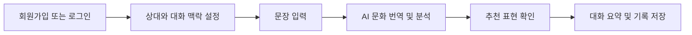

<div align="center">
  

  # MalGo

  ### 그냥 번역하지 말고, 문화까지.

  상대방의 국가·문화·관계·상황을 고려해
  더 자연스럽고 안전한 표현을 제안하는 AI 문화 번역 서비스입니다.

  [서비스 바로가기](https://malg0.netlify.app)

  <br />

  
  
  

  <br />
  <br />

  
  
</div>

---

## 소개

MalGo는 단어를 직역하는 데 그치지 않고, 상대방의 문화권·관계·말투를 함께 고려해 더 자연스러운 표현을 제안합니다. 문화적 오해 가능성을 분석하고, 상황에 맞는 대체 문장과 대화 요약을 제공합니다.

> 말을 넘어, 문화를 연결합니다.

## 주요 기능

| 기능 | 설명 |
| --- | --- |
| 회원 인증 | 회원가입, 로그인, 로그아웃과 세션 복원을 지원합니다. |
| 문화 맥락 번역 | 입력 문장을 분석해 번역 결과와 문화적 적절성을 제공합니다. |
| 대화 관리 | 대화를 생성하고 메시지를 주고받으며 요약을 생성합니다. |
| 번역·대화 기록 | 이전 번역과 대화 요약을 조회하고 메모를 저장할 수 있습니다. |
| AI 맞춤 설정 | 대상 언어, 상대와의 관계, 성별, 표정, 말투를 설정합니다. |
| 구독 관리 | 멤버십·프리미엄 구독 상태를 확인하고 관리합니다. |
| 반응형 UI | 휴대폰부터 태블릿까지 모바일 우선 레이아웃을 제공합니다. |
| 지연 로딩 | 라우트 단위 코드 분할과 전체 화면 로딩 인디케이터를 적용했습니다. |

## 서비스 흐름



## 화면 경로

| 경로 | 화면 |
| --- | --- |
| `/` | 스플래시 |
| `/login` | 로그인 |
| `/signup` | 회원가입 |
| `/main` | 문화 번역 대화 |
| `/summary` | 대화 요약·분석 |
| `/translation-history` | 최근 번역 기록 |
| `/translation-history/:historyId` | 번역 기록 상세 |
| `/mypage` | 마이페이지·구독 관리 |

`/main` 이하의 기능은 로그인 후 이용할 수 있습니다.

## 기술 스택

| 구분 | 기술 |
| --- | --- |
| UI | React 19, JavaScript, CSS3 |
| 라우팅 | React Router 7 |
| API 통신 | Fetch API, 세션 쿠키 기반 인증 |
| 빌드 | Create React App (`react-scripts`) |
| 배포 | Netlify |
| 백엔드 API | `https://1.201.117.165.sslip.io` |

## 프로젝트 구조

```text
MalGo_Front/
├── src/
│   ├── api/                   # 인증, 대화, 번역, 구독 API
│   ├── Splash/                # 스플래시 화면
│   ├── Login/ · Signup/       # 인증 화면
│   ├── Mainpage/              # 문화 번역 대화 화면
│   ├── Summarypage/           # 요약·분석 화면
│   ├── TranslationHistory/    # 번역 기록·메모
│   ├── Mypage/                # 마이페이지
│   ├── AiCustomization/       # AI 맞춤 설정
│   ├── Loading/               # 공통 지연 로딩 UI
│   └── SubscriptionModal/     # 구독 UI
├── public/
├── netlify.toml               # Netlify 빌드·SPA 리다이렉트 설정
└── package.json
```

## 로컬 실행

### 요구 사항

- Node.js LTS
- npm

### 실행

```bash
git clone https://github.com/seungjae223/MalGo_Front.git
cd MalGo_Front
npm install
npm start
```

개발 서버는 `http://localhost:3000`에서 실행됩니다.

### API 주소 변경

기본 API 주소는 HTTPS 백엔드로 설정되어 있습니다. 다른 환경을 사용하려면 프로젝트 루트에 `.env` 파일을 만들고 아래처럼 설정합니다.

```env
REACT_APP_API_BASE_URL=https://your-api.example.com
```

Create React App 환경 변수는 빌드 시점에 반영되므로 값을 바꾼 뒤 개발 서버 또는 배포 빌드를 다시 실행해야 합니다.

### 검증 및 빌드

```bash
npm test -- --watchAll=false
npm run build
```

## 배포

프런트엔드는 Netlify에서 배포합니다. `netlify.toml`에 다음을 설정해 두었습니다.

- 빌드 명령: `npm run build`
- 배포 디렉터리: `build`
- SPA 리다이렉트: 모든 경로를 `index.html`로 제공

GitHub `main` 브랜치에 푸시하면 Netlify가 자동 배포합니다. 프로덕션에서는 `REACT_APP_API_BASE_URL`을 HTTPS API 주소로 설정하고, 백엔드에서 배포 도메인의 CORS 및 보안 쿠키를 허용해야 합니다.

## Repository

- Frontend: [seungjae223/MalGo_Front](https://github.com/seungjae223/MalGo_Front)
- Live: [malg0.netlify.app](https://malg0.netlify.app)

## Contributors

<a href="https://github.com/seungjae223/MalGo_Front/graphs/contributors">
  
</a>
